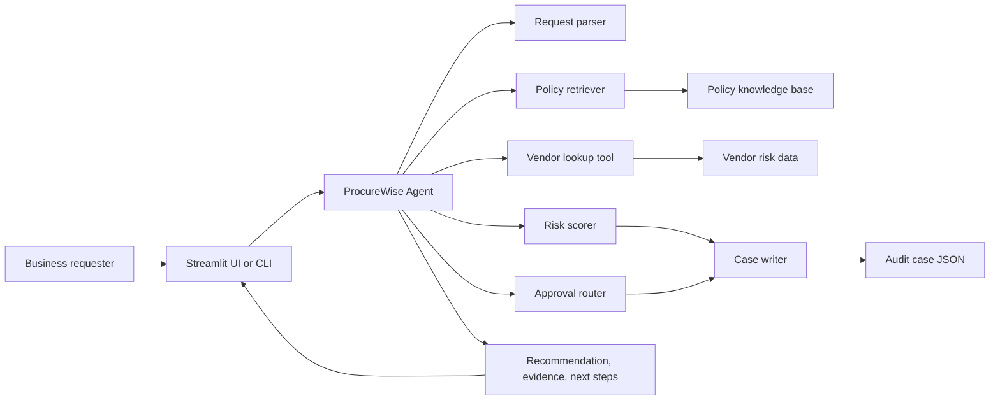
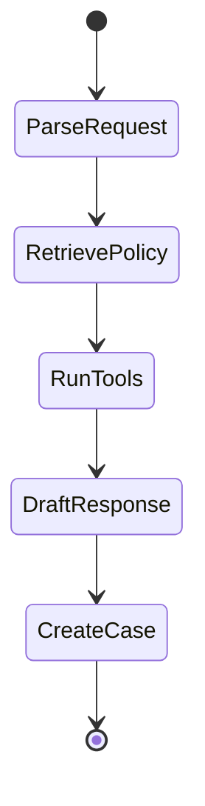

# ProcureWise Architecture

## Architecture Summary

ProcureWise is a Track A single-agent system. The agent uses a structured workflow that combines RAG, tool calls, deterministic risk rules, and a user-facing recommendation.

## Agent Workflow

The implementation supports LangGraph when installed. The same nodes also run through a deterministic local workflow so the project can be demonstrated without paid API access.

## Components

- User interface: `app/streamlit_app.py`
- Agent orchestration: `src/procurewise/agent.py`
- RAG retrieval: `src/procurewise/retriever.py`
- Tools and actions: `src/procurewise/tools.py`
- Prompt design: `src/procurewise/prompts.py`
- Knowledge base: `data/knowledge_base/*.md`
- Vendor data: `data/vendors.csv`
- Runtime case output: `data/runtime/*.json`

## State Design

The agent stores raw state between steps:

- Original request text
- Parsed facts such as amount, vendor, department, category, and data sensitivity
- Retrieved policy evidence
- Vendor lookup result
- Approval routing result
- Risk score result
- Recommendation
- Case ID

This follows the LangGraph pattern of making each node a focused function that reads and writes shared state.

## Retrieval Design

The RAG layer indexes local policy documents by heading. It uses tokenization, term frequency, and inverse document frequency scoring to retrieve the most relevant policy passages. This is intentionally lightweight for a classroom demo, but the architecture can be upgraded to embeddings and a vector database.

## Tool/API Design

The tools act like internal business APIs:

- `request_parser`: extracts structured facts from unstructured text.
- `vendor_lookup`: checks whether the vendor is known and what its risk posture is.
- `approval_router`: maps spend level to required approvals.
- `risk_scorer`: combines spend, data sensitivity, vendor status, SOC 2 status, and contract status.
- `case_writer`: writes an audit-ready JSON case record.

## Human Oversight

The agent never becomes the final approver. It recommends routing, evidence, risk level, and next steps. Final approval remains with department, procurement, security, finance, legal, or executive owners depending on request risk.

## Scalability

For a production implementation, the following upgrades would be made:

- Replace CSV vendor data with ERP/procurement API integrations.
- Replace local JSON case output with a ticketing or procurement workflow API.
- Add persistent vector storage for policy documents.
- Add authentication and role-based access controls.
- Add observability through LangSmith or an enterprise logging platform.
- Deploy with Docker on a managed container platform or Kubernetes.

